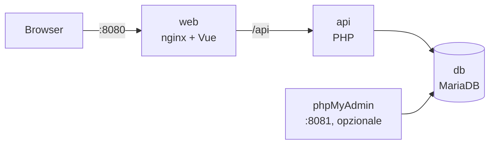

# WebDev · Console di gestione e monitoraggio dispositivi

Interfaccia web per gestire i dispositivi e le loro curve di protezione tempo/corrente: elenco, inserimento e modifica con controllo dei dati, grafico della curva, importazione da file XML.

Gira in container Docker ed è pensata per un **Raspberry Pi**; si prova prima su un **Mac con Apple Silicon** (M1/M2/M3) o su un PC.

| Componente | Tecnologia |
|---|---|
| Interfaccia | Vue 3 + Vite, servita da nginx |
| API | PHP 8.2 (JSON) su Apache |
| Database | MariaDB 11.4 (LTS) |
| Strumenti (opzionali) | phpMyAdmin |



---

## Indice

- [Requisiti](#requisiti)
- [Installazione rapida (Mac o PC)](#installazione-rapida-mac-o-pc)
- [Installazione su Raspberry Pi](#installazione-su-raspberry-pi)
- [Configurazione](#configurazione)
- [Uso](#uso)
- [Sviluppo](#sviluppo)
- [Aggiornamento](#aggiornamento)
- [Backup](#backup)
- [Problemi frequenti](#problemi-frequenti)
- [Struttura del progetto](#struttura-del-progetto)
- [Documentazione](#documentazione)
- [Licenza](#licenza)

---

## Requisiti

| | Mac / PC (prova) | Raspberry Pi (esercizio) |
|---|---|---|
| Hardware | Mac Apple Silicon o PC x86-64 | Raspberry Pi 4 o 5, consigliati almeno 2 GB di RAM |
| Sistema | macOS 13+, Windows 10/11 con WSL2, Linux | **Raspberry Pi OS 64 bit** (Bookworm o successivo) |
| Software | [Docker Desktop](https://www.docker.com/products/docker-desktop/) | Docker Engine + plugin Compose |
| Altro | Git | Git |

Verifica che Docker sia installato:

```bash
docker --version
docker compose version
```

> Su Raspberry serve il sistema **a 64 bit**: con `uname -m` deve comparire `aarch64`.

---

## Installazione rapida (Mac o PC)

```bash
# 1. Scarica il progetto
git clone https://github.com/ingrubino/WebDev.git
cd WebDev/docker

# 2. Crea la configurazione e cambia le password
cp .env.example .env
nano .env            # oppure: open -e .env

# 3. Costruisci e avvia
docker compose up -d --build

# 4. Controlla che tutto sia attivo
docker compose ps
```

Apri **http://localhost:8080**.

Il primo avvio richiede qualche minuto: Docker scarica le immagini, compila l'interfaccia e il database crea le tabelle.

---

## Installazione su Raspberry Pi

### 1. Preparare il sistema

Installa Raspberry Pi OS 64 bit con [Raspberry Pi Imager](https://www.raspberrypi.com/software/) (nelle impostazioni avanzate abilita SSH e imposta utente e nome host), poi collegati:

```bash
ssh pi@raspberrypi.local
sudo apt update && sudo apt full-upgrade -y
sudo apt install -y git
```

### 2. Installare Docker

```bash
curl -fsSL https://get.docker.com | sh
sudo usermod -aG docker $USER
```

Esci e rientra (`exit`, poi di nuovo `ssh`) per usare Docker senza `sudo`, quindi verifica:

```bash
docker run --rm hello-world
docker compose version
```

### 3. Scaricare e configurare il progetto

```bash
git clone https://github.com/ingrubino/WebDev.git
cd WebDev/docker
cp .env.example .env
nano .env      # imposta password robuste
```

### 4. Avviare

```bash
docker compose up -d --build
docker compose ps
```

Dal computer della stessa rete apri **http://raspberrypi.local:8080** (oppure `http://<indirizzo-ip-del-raspberry>:8080`; l'indirizzo si vede con `hostname -I`).

I servizi ripartono da soli al riavvio del Raspberry (`restart: unless-stopped`).

> **Build lenta sul Raspberry?** La compilazione dell'interfaccia richiede memoria. Puoi costruire le immagini sul Mac e copiarle: vedi [Rilascio sul Raspberry](docs/02-manutenzione.md#8-rilascio-sul-raspberry).

---

## Configurazione

Tutte le impostazioni stanno nel file `docker/.env` (creato da `docker/.env.example`, non va mai caricato su GitHub).

| Variabile | Predefinito | Descrizione |
|---|---|---|
| `WEB_PORT` | `8080` | Porta dell'interfaccia web |
| `PMA_PORT` | `8081` | Porta di phpMyAdmin (se attivo) |
| `DB_NAME` | `testdb` | Nome del database |
| `DB_USER` | `app` | Utente usato dall'API |
| `DB_PASSWORD` | *(obbligatoria)* | Password dell'utente dell'API |
| `DB_ROOT_PASSWORD` | *(obbligatoria)* | Password di amministrazione del database |
| `IMAGE_PREFIX` | `webdev` | Prefisso delle immagini (es. `ghcr.io/utente/webdev` per pubblicarle) |
| `TAG` | `latest` | Versione delle immagini |

Dopo una modifica a `.env`: `docker compose up -d`.

> Le password di `.env` vengono usate dal database **solo alla prima creazione**. Per cambiarle dopo, vedi [Problemi frequenti](#problemi-frequenti).

### Servizi opzionali

```bash
docker compose --profile tools up -d     # phpMyAdmin su http://localhost:8081
docker compose --profile legacy up -d    # vecchia interfaccia PHP su http://localhost:8082 (confronto)
```

Non lasciare phpMyAdmin attivo sul Raspberry se non serve.

---

## Uso

| Pagina | Indirizzo | Funzione |
|---|---|---|
| Elenco dispositivi | `/` | tutti i dispositivi con filtro per nome, numero di punti, data |
| Nuovo dispositivo | `/devices/new` | inserimento manuale o da file XML, con controllo dei valori e grafico |
| Dettaglio | `/devices/<nome>` | modifica, rinomina, grafico della curva, eliminazione con conferma |
| Import CSV | `/import` | importazione di più dispositivi con anteprima; vengono salvati solo quelli validi |

La spia in alto a destra indica se API e database rispondono (verde "online").

### Regole sui dati

- **Nome**: obbligatorio, max 100 caratteri, lettere, numeri, spazio, `_`, `.`, `-`.
- **Curva tempo/corrente**: da 2 a 10 punti; tempo (ms) ≥ 0 e crescente; corrente (A) ≥ 0.
- **Vettore**: fino a 10 valori numerici (opzionali). La virgola decimale (`1,5`) è accettata.

I limiti si cambiano in un solo file, `vue/config/device-rules.json`, valido sia per l'interfaccia sia per l'API; dopo la modifica serve `docker compose up -d --build`.

I valori non validi vengono segnalati accanto al campo e il salvataggio resta bloccato finché non sono corretti; l'API applica gli stessi controlli.

### Formato del file XML

```xml
<data>
  <identifier>InterruttoreXX2</identifier>
  <matrix>
    <row><col1>0</col1><col2>100</col2></row>
    <row><col1>1</col1><col2>100</col2></row>
    <!-- fino a 10 righe: col1 = tempo (ms), col2 = corrente (A) -->
  </matrix>
  <vector>
    <value>1.1</value>
    <!-- fino a 10 valori -->
  </vector>
</data>
```

Un esempio completo è in [`src/data.xml`](src/data.xml). Il file riempie il form del dispositivo: si controllano i valori e poi si salva.

### Formato del file CSV

Una riga per punto della curva; le righe con lo stesso nome formano un dispositivo e il vettore si prende dalla prima. Separatore `,` oppure `;` (Excel in italiano); un'intestazione `identifier,...` viene ignorata.

```csv
identifier,col1,col2,v1,v2,v3
InterruttoreXX2,0,100,1.1,2.2,2.2
InterruttoreXX2,1,100
InterruttoreXX2,2,90
```

### API

L'interfaccia usa un'API JSON raggiungibile anche direttamente:

```bash
curl http://localhost:8080/api/health
curl http://localhost:8080/api/devices
curl http://localhost:8080/api/devices/InterruttoreXX2
```

Elenco completo degli endpoint in [vue/README.md](vue/README.md#api).

---

## Sviluppo

Modalità con ricaricamento automatico: le modifiche all'interfaccia e all'API si vedono subito senza ricostruire le immagini.

```bash
cd docker
docker compose -f compose.yml -f compose.dev.yml up
```

Apri http://localhost:8080. Le modifiche in `vue/frontend`, `vue/api` e `vue/config` si vedono subito. Non serve installare Node sul Mac: il server di sviluppo Vite gira in un container. Per eseguire i test delle regole (con Node installato):

```bash
cd vue/frontend
npm install
npm test
```

Come aggiungere schermate, campi e regole di validazione: [docs/02-manutenzione.md](docs/02-manutenzione.md).

### Immagini multi-architettura

Per pubblicare immagini valide sia per PC (`amd64`) sia per Mac e Raspberry (`arm64`):

```bash
cd docker
docker login                                   # Docker Hub (o: docker login ghcr.io)
docker buildx create --name multi --use        # solo la prima volta
export IMAGE_PREFIX=<utente>/webdev TAG=1.0.0
docker buildx bake -f docker-bake.hcl --allow=fs.read=.. --push
```

Sul Raspberry basterà impostare gli stessi `IMAGE_PREFIX` e `TAG` nel `.env` e usare `docker compose pull && docker compose up -d --no-build`. Altre opzioni (copia con file `.tar`, senza registry) in [docker/README.md](docker/README.md).

---

## Aggiornamento

```bash
cd WebDev
git pull
cd docker
docker compose up -d --build
```

Se la nuova versione modifica il database, il `CHANGELOG.md` lo indica: fai prima un backup e applica la migrazione come descritto in [docs/02-manutenzione.md](docs/02-manutenzione.md#modificare-il-database).

---

## Backup

```bash
cd docker
mkdir -p ../backup
docker compose exec -T db sh -c 'mariadb-dump -u root -p"$MARIADB_ROOT_PASSWORD" "$MARIADB_DATABASE"' \
    > ../backup/webdev_$(date +%Y%m%d).sql
```

Ripristino:

```bash
docker compose exec -T db sh -c 'mariadb -u root -p"$MARIADB_ROOT_PASSWORD" "$MARIADB_DATABASE"' \
    < ../backup/webdev_AAAAMMGG.sql
```

---

## Problemi frequenti

| Problema | Soluzione |
|---|---|
| `imposta DB_PASSWORD nel file .env` | Manca il file `.env`: `cp .env.example .env` nella cartella `docker/` |
| La pagina non si apre | `docker compose ps` per vedere quale servizio è fermo, poi `docker compose logs <servizio>` |
| "Errore database" nell'interfaccia | Il database sta ancora partendo (attendi lo stato `healthy`) oppure le password in `.env` non corrispondono a quelle con cui è stato creato |
| Ho cambiato le password in `.env` ma non funzionano | Il database conserva quelle della prima creazione. Cambiale dentro MariaDB, oppure, **cancellando tutti i dati**, `docker compose down -v` e `docker compose up -d` |
| `no matching manifest for linux/arm/v7` sul Raspberry | Il sistema è a 32 bit e MariaDB non esiste per armv7: installa Raspberry Pi OS **64 bit** |
| `port is already allocated` | La porta è occupata: cambia `WEB_PORT` in `.env` |
| `permission denied ... docker.sock` | Manca il gruppo docker: `sudo usermod -aG docker $USER`, poi esci e rientra |

---

## Struttura del progetto

```
WebDev/
├─ vue/
│  ├─ frontend/     interfaccia Vue 3 (Vite)
│  ├─ api/          API PHP (JSON)
│  ├─ config/       device-rules.json: regole di validazione condivise
│  └─ db/init/      schema iniziale del database
├─ docker/          compose.yml, compose.dev.yml, Dockerfile del frontend, nginx, .env.example
├─ docs/            procedura delle schermate e guida di manutenzione
├─ src/             vecchia interfaccia PHP (riferimento durante la migrazione)
└─ LICENSE
```

---

## Documentazione

- [Procedura per definire e completare le schermate](docs/01-procedura-schermate.md)
- [Manutenzione e integrazione di nuove funzioni](docs/02-manutenzione.md)
- [Codice dell'applicazione: schermate, API, regole](vue/README.md)
- [Dettagli Docker e architetture supportate](docker/README.md)

---

## Licenza

Distribuito con licenza **GNU GPL v3**. Vedi [LICENSE](LICENSE).
